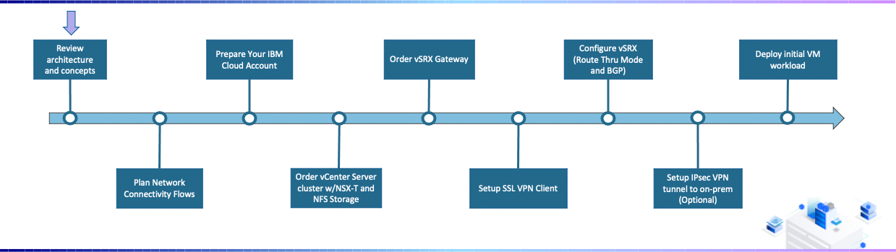
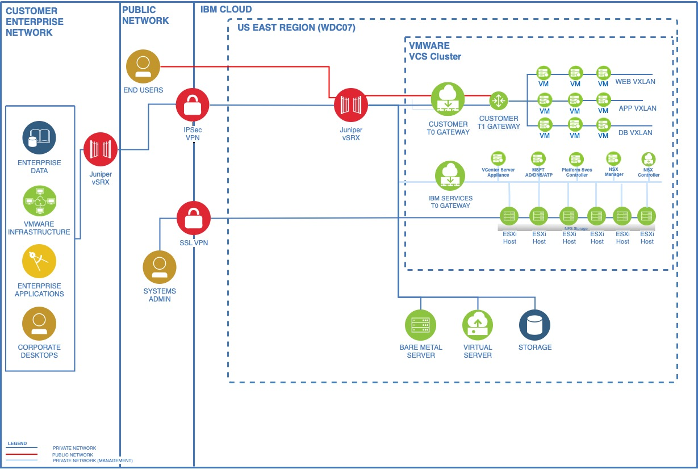

---

copyright:
  years: 2021
lastupdated: "2021-11-05"

subcollection: vmware-classic-journey

---

{{site.data.keyword.attribute-definition-list}}

# Deployment Journey Overview
{: #vmware-onboarding-architecture-and-concepts}

IBM Cloud for VMware Solutions makes it simpler for your organization to capitalize on the tremendous value of the cloud. The solution provides a path to migrate VMware workloads to the IBM Cloud while using existing tools, technologies and skills from your on-premises environment.  The information contained within this document is meant to serve as a technical guide for starting with a new IBM Cloud towards a fully configured VMware instance. 
{: shortdesc}

Welcome to the Deployment Journey for VMware on IBM Cloud! Use the sidebar on the left to navigate between the journey points.
{: tip}

## Journey Map
{: #vmware-onboarding-architecture-and-concepts-map}

{: class="center"}

## Assumptions
{: #vmware-onboarding-architecture-and-concepts-assumptions}

The deployment journey will be assuming the following scenario. Please note that while your circumstance may not be exactly identical, you will still benefit from the overall journey steps and concepts covered in this guide.

- Goal is to deployment VMware workload on IBM Cloud.
- VMs will need to be able to access the Internet (source NAT) as well as certain VMs will need to be directly accessible from the Internet (destination NAT).
- Already familiar with Juniper networking technology on-premises, and wishes to do the same on IBM Cloud (so a vSRX Gateway device will be used).
- An initial non-prod environment to be provisioned:
   - A single VMware instance (cluster) 
   - vSphere 7.0 with NSX-T
   - 6 hosts (bare metal servers) each running Intel Xeon Gold 5218 with 192GB RAM
   - 5TB of NFS storage 

IBM Cloud for VMware Solutions provides different offerings to address different client needs and the [offering comparison chart](https://{DomainName}/vmwaresolutions?topic=vmwaresolutions-inst_comp_chart) details the differences.
{: tip}

## Architecture
{: #vmware-onboarding-architecture-and-concepts-prereqs}

The following architecture represents the pattern this deployment journey will following.  

{: class="center"}

## Next Steps
{: #vmware-onboarding-architecture-and-concepts-next-steps}

The next step in the series is:

* [Understanding Network Flows](/docs/solution-tutorials?topic=solution-tutorials-vmware-onboarding-vrf-service-endpoints)
