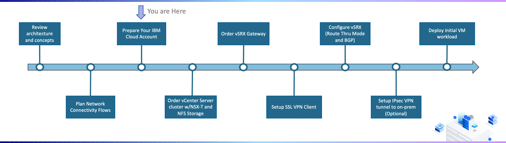

---

copyright:
  years: 2021, 2022
lastupdated: "2022-01-31"

subcollection: vmware-classic-journey

---

{{site.data.keyword.attribute-definition-list}}

# Prepare Your {{site.data.keyword.Bluemix_notm}} Account
{: #vmware-onboarding-prepare-account}

## Journey Map
{: #vmware-onboarding-prepare-account-map}

{: class="center"}

## Enabling Virtual Routing and Forwarding with Service Endpoints
{: #vmware-onboarding-prepare-account-vrf}

The deployment of VMware on {{site.data.keyword.Bluemix_notm}} requires Virtual Routing and Forwarding (VRF) to be enabled on your cloud account. VRF enables your account with the required routing tables  and allows the use of IPs that normally would not be allowed. Additional details on VRF can be found within the [documentation](https://{DomainName}/docs/direct-link?topic=direct-link-overview-of-virtual-routing-and-forwarding-vrf-on-ibm-cloud).

Enabling service endpoints allows your workload running on VMware to communicate with {{site.data.keyword.Bluemix_notm}} Services over the {{site.data.keyword.Bluemix_notm}} private network (i.e. VMware workload communicating with Redis, IBM Log Analysis, etc.) In addition, there is no billable or metered bandwidth charges on the private network. In order to benefit from service endpoints, VRF must first be enabled. 

The steps you should follow are described in the following sections within the {{site.data.keyword.Bluemix_notm}} Documentation:

-  [Enabling VRF in the Console](https://{DomainName}/docs/account?topic=account-vrf-service-endpoint&interface=ui#vrf) 
-  [Enabling Service Endpoints](https://{DomainName}/docs/account?topic=account-vrf-service-endpoint&interface=ui#service-endpoint) 

If you are working on a brand new {{site.data.keyword.Bluemix_notm}} Account, you will most likely find this feature will need to be enabled. If you are working in a cloud account which has been established and running workload, it's common to find this feature has already been enabled. 
{: tip}

## Configure IAM
{: #vmware-onboarding-prepare-account-iam}

IBM Identity and Access Management (IAM) should be planned ahead and configured before the provisioning of a VMware solution on {{site.data.keyword.Bluemix_notm}}. The VMware solution described in this guide will be deployed on Classic Infrastructure (not VPC), so you must have certain Classic Infrastructure permissions to be able to order the underlying devices VMware will be deployed to.  Please refer to the follow assets to understand IAM concepts and required Classic Infrastructure permissions:

- [Understand IAM Concepts in the {{site.data.keyword.Bluemix_notm}}](https://{DomainName}/docs/account?topic=account-iamoverview)

- [How to Manage Classic Infrastructure Access](https://{DomainName}/docs/account?topic=account-mngclassicinfra)

- [Required Classic Infrastructure Permissions Needed for VMware Deployments on Classic Infrastructure](https://{DomainName}/docs/vmwaresolutions?topic=vmwaresolutions-cloud-infra-acct-req)

In addition to having the right Classic Infrastructure permissions for deploying the underlying hardware devices, users need the right level of Platform Management permissions in order to work with the VMware service instance (i.e. who can see provisioned VMWare instances, who can delete an instance, etc). Please refer to the following asset to understand the required   platform management roles:

- [Configuring Platform Management Roles for VMware Service](https://{DomainName}/docs/vmwaresolutions?topic=vmwaresolutions-iam)

## Setup Resource Group
{: #vmware-onboarding-prepare-account-resource-groups}

Resource Groups allow you to organize the resources/instances into groups (i.e. ProjectA_Resources, ProjectB_Resources, Dev_Env, Prod_Env, etc.), and can be used as part of the access management strategy (i.e. Developers granted access to resources in Dev_Env resourcce group but no access to Prod_env). When a VMware instance is provisioned, it must be placed within a resource group. Please refer to the follow assets to understand the best practices for using resource groups:

- [Best practices for resource groups and assigning access](https://{DomainName}/docs/account?topic=account-account_setup)

## Create a Classic Infrastructure API Key
{: #vmware-onboarding-prepare-account-apikey}

The VMware solution described in this guide will be deployed on Classic Infrastructure (not VPC), so you need to have a Classic Infrastructure API associated with your {{site.data.keyword.Bluemix_notm}} Userid. The key is used as part of the provisioning process (i.e. provisioning the underlying bare metals on Classic Infrastructure where VMware will be running).

The steps to configure your Classic Infrastruture API key can be found in the [documentation](https://{DomainName}/docs/account?topic=account-classic_keys#create-classic-infrastructure-key).

## Next Steps
{: #vmware-onboarding-resource-groups-iam-next-steps}

The next step on the deployment journey is:

* [Order vCenter Server](/docs/vmware-classic-journey?topic=vmware-classic-journey-vmware-onboarding-order-cluster-storage)

