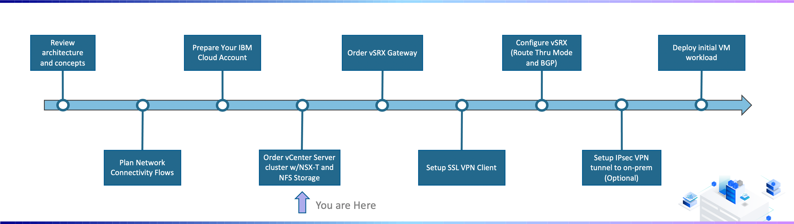
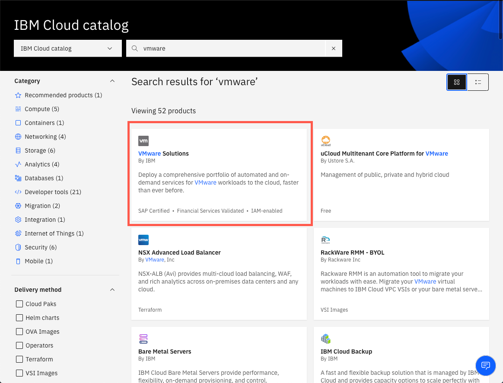
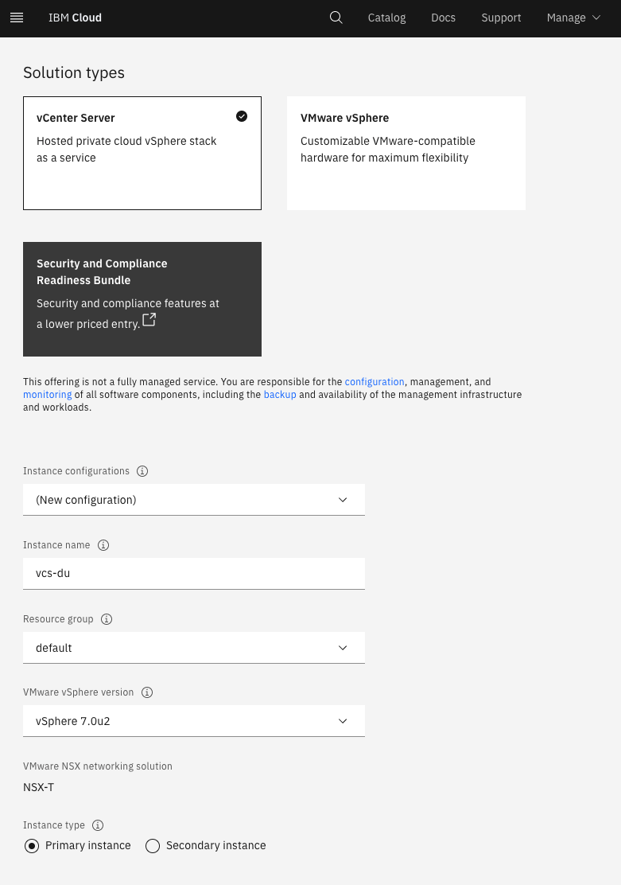
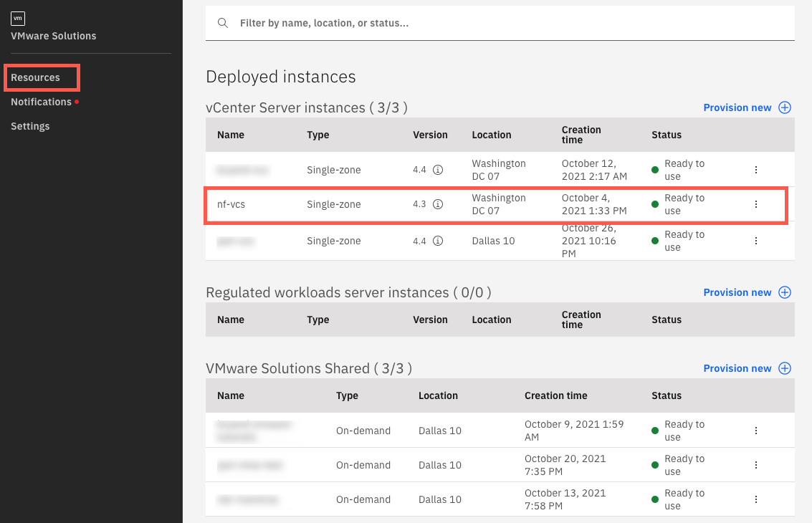

---

copyright:
  years: 2021, 2022
lastupdated: "2022-01-31"

subcollection: vmware-classic-journey

---

{{site.data.keyword.attribute-definition-list}}

# Order vCenter Server cluster w/NSX-T and Storage
{: #vmware-onboarding-order-cluster-storage}

In this section of the deployment journey, a VCS environment is ordered. The information below will focus on commonly used configuration. 

Ordering a VCS environment is accomplished via an ordering form in the {{site.data.keyword.Bluemix_notm}} Catalog. Automated deployment will provision the required VLANs, bare metal servers, and VCS software. For the purposes of this guide, the following assumptions are being made:

- A single VMware instance (cluster) to be located in Washington 07 
- vSphere 7.0 with NSX-T
- 6 hosts (bare metal servers) each running Intel Xeon Gold 5218 with 192GB RAM
- 5TB of NFS storage 

## Journey Map
{: #vmware-onboarding-order-cluster-storage-map}

{: class="center"}

## Detailed Steps
{: #vmware-onboarding-order-cluster-storage-provision}

1. Login to the {{site.data.keyword.Bluemix_notm}} and navigate to the {{site.data.keyword.Bluemix_notm}} Catalog. Search for and click on the VMware Solutions tile:

   {: class="center"}
   
   
   
1. Select the VMware Solutions Dedicate resource.

   {: class="center"}
   
   
   
1. Based on the previously stated assumptions, the following options were selected during the ordering process. Please refer to the walk through video and/or documentation for additional considerations around the options selected.

   {: class="center"}

   

   **Solution type:**

   * Server Type: vCenter Server
   * Instance configuration: New Configuration
   * VMware vSphere Version: vSphere 7.0u2
   * Instance type: Primary instance

   **Licensing:**

   * vCenter Server - Standard: Include with purchase
   * vSphere Enterprise Plus:  Include with purchase
   * NSX:  Include with purchase, NSX-T Advanced license

   **Consolidated cluster:**

   - Location: _Select a zone for example wdc07_
   - CPU Generation: Cascade Lake
   - CPU model: Gold 5128
   - RAM: 192GB
   - Number of servers: 6
   - Storage: NFS storage
   - Configure shares individually: _leave unchecked_
   - Number of shares: 1
   - Size: 5000
   - Performance : 2IOPS/GB
   - Networking type: Public and private network
   - Uplink speed: 10GB
   - VLANs: Order new VLANs

   **Workload cluster:**

   - Include a separate, additional workload cluster: _leave unchecked_

   **Edge servers cluster:**

   - Edge services cluster: _leave unchecked_

   **Network interface:**

   - Hostname prefix: _enter a hostname for example esxi-0_
   - Domain name: _enter a domain name for example wdc07.mycompany.local_
   - DNS configuration: Single public Windows VSI for Active Directory/DNS

   **Recommended services:**

   - No recommended or optional services at this time
     

1. Once completed. The provisioned instance will appear in the VMware Solutions Resources view. 

{: class="center"}

## Next Steps
{: #vmware-onboarding-order-cluster-storage-next-steps}

The next step on the deployment journey is:

* [Order vSRX Gateway](/docs/vmware-classic-journey?topic=vmware-classic-journey-vmware-onboarding-vsrx-gateway)

