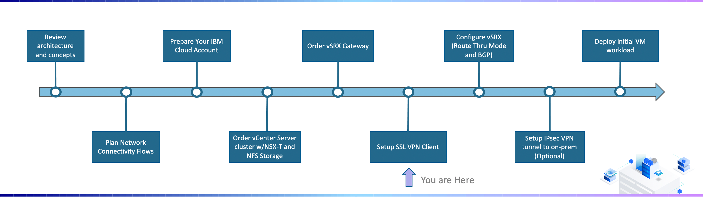
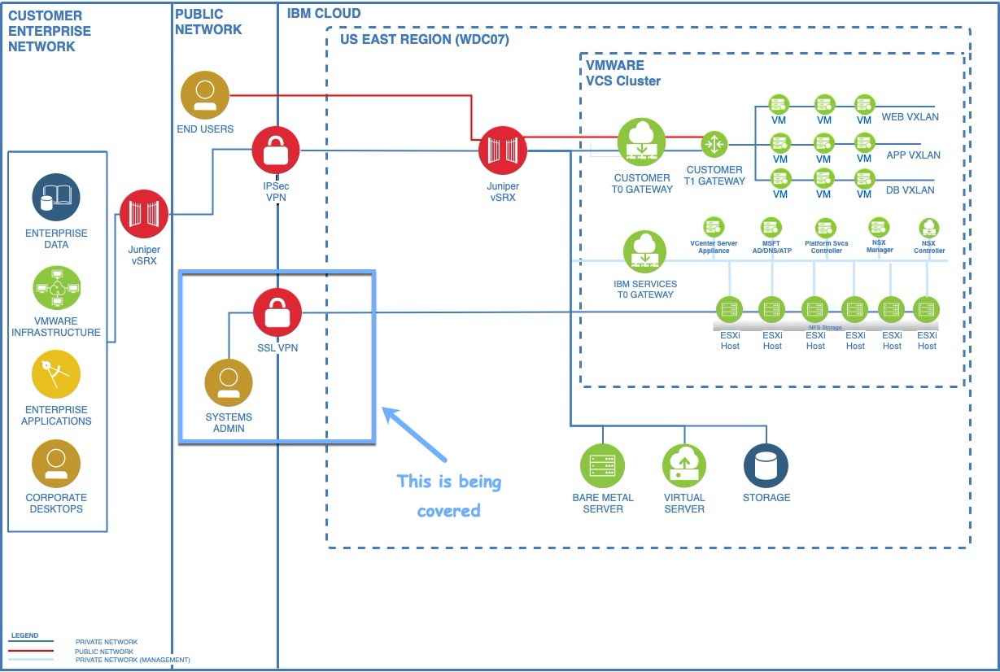
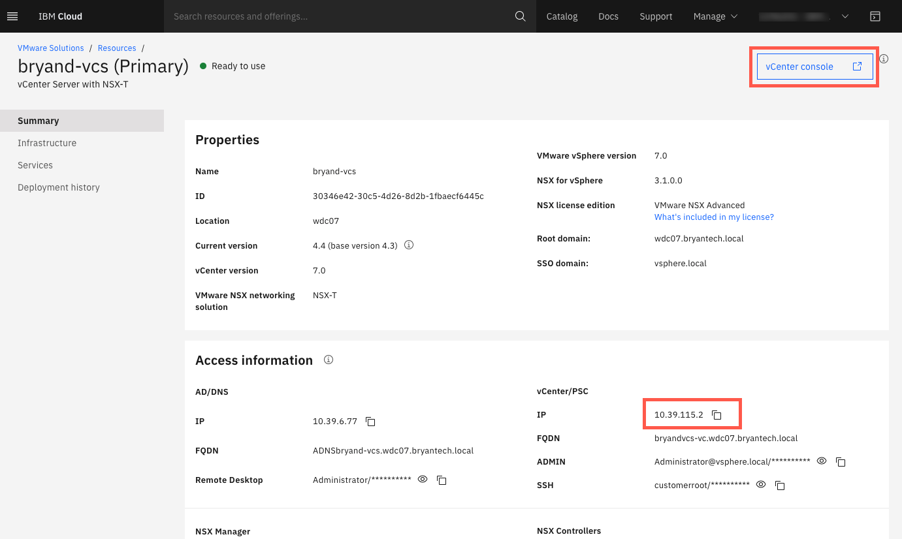

---

copyright:
  years: 2021
lastupdated: "2021-11-05"

subcollection: vmware-classic-journey

---

{{site.data.keyword.attribute-definition-list}}

# Setup SSL VPN Client
{: #vmware-onboarding-ssl-vpn-client}

In this section of the deployment journey, a SSL VPN client is configured. The SSL VPN client establishes connectivity with the IBM Cloud Classic Infrastructure. 

## Journey Map
{: #vmware-onboarding-ssl-vpn-client-map}

{: class="center"}

As shown in the architecute below, the SSL VPN allows you to connect to the 10.x.x.x Private IPs of the  VCS Cluster for managemenet and configuration purposes.  For production, businesses will typically establish network connectivity to the IBM Cloud Classic Infra via Direct Link or Site-to-Site VPN, but having the SSL VPN client configured is useful for initial configuration and/or to serve as a backup.

{: class="center"}

## Detailed Instructions
{: #vmware-onboarding-ssl-vpn-client-instructions}

Complete the steps on the VPN [Getting started](https://{DomainName}/docs/iaas-vpn?topic=iaas-vpn-getting-started#enable-user-vpn-access) page to:

1. Enable SSL VPN access for your account
2. Set the SSL VPN password
3. Login to the VPN

Once connected, validate connectivity by pinging the vCenter IP and/or opening the vCenter console:

{: class="center"}

## Next Steps
{: #vmware-onboarding-ssl-vpn-client-next-steps}

The next step on the deployment journey is:

* [Configure vSRX (Route Thru Mode and BGP)](/docs/solution-tutorials?topic=solution-tutorials-vmware-onboarding-route-through-and-bgp-setup)

