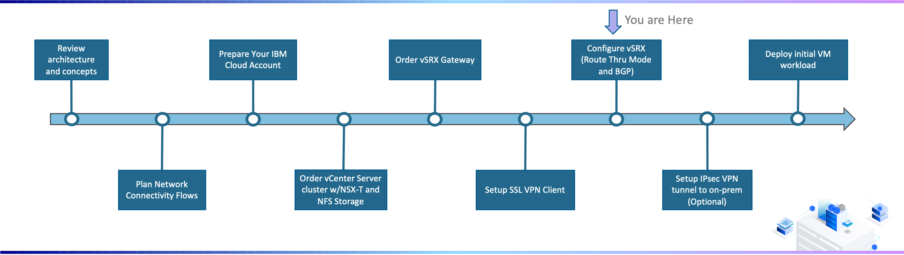
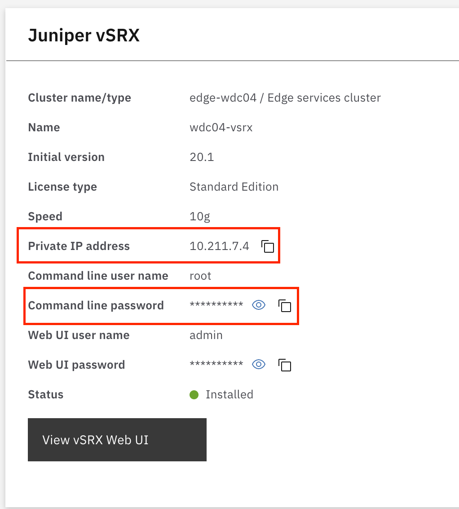
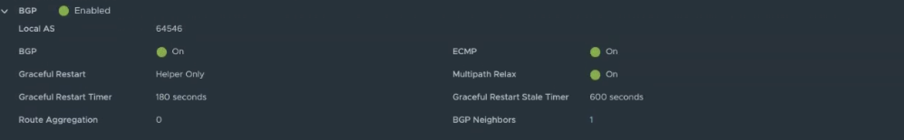
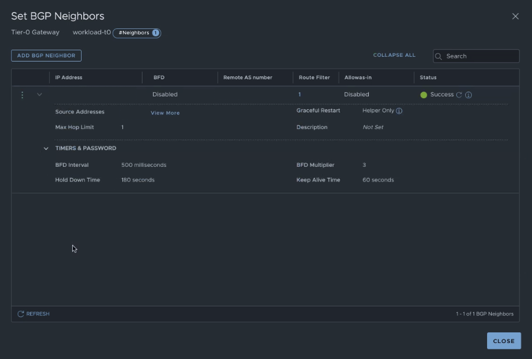

---

copyright:
  years: 2021, 2022
lastupdated: "2022-02-02"

subcollection: vmware-classic-journey

---

{{site.data.keyword.attribute-definition-list}}

# Configure vSRX Gateway
{: #vmware-onboarding-route-through-and-bgp-setup}


## Journey Map
{: #vmware-onboarding-route-through-and-bgp-setup-map}

{: class="center"}


## Overview
{: #vmware-onboarding-route-through-and-bgp-setup-overview}

This step of the deployment journey will cover the configuration of the gateway device. More specifically, route thru mode and BGP will be configured.  

- These instructions assume that no additional configuration has been done on the vSRX.
- The setup will route the Primary VLAN of your VCS instance only. Secondary VLANs can also be routed but an additional interface unit on the vSRX would have to be configured.
- Rules provided are for private-to-private communication only. This configuration will allow the vSRX to supplant the Backend Customer Router (BCR) as the ‘next-hop’ for the VCS environment.
- While firewall policies are configured, they are set as ‘allow all’. More detailed configuration is possible but outside the scope of this document. 
- A configured VPN client in order to be able to connect to the {{site.data.keyword.Bluemix_notm}} private network for your account. You can find information on how to download and install the standalone VPN client at [Setup SSL VPN Client](/docs/vmware-classic-journey?topic=vmware-classic-journey-vmware-onboarding-ssl-vpn-client). 

## Initial vSRX Configuration
{: #vmware-onboarding-route-through-and-bgp-setup-init-config}

The steps below will walk through the steps required in order to correctly configure the vSRX.

1. Log into your VPN client, bring up a browser on your machine and log into {{site.data.keyword.Bluemix_notm}} at https://{DomainName}. 
2. From the {{site.data.keyword.Bluemix_notm}} home page of your account, **click** on the hamburger menu in the upper left corner and navigate to VMware -> Resources.
3. Select the vCenter Server instances that has the vSRX deployed.
4. In the left-hand menu pane, **select** Services.
5. Select Juniper vSRX in the menu.
6. On the Juniper vSRX screen – capture the Private IP address and the command line password for the device. Below is an example from our test instance.

    {: class="center"}

7. Open a command terminal (on Linux or MacOS) or an SSH client (on Windows) and log into the vSRX. Using the example above on MacOS, you would open a terminal and type:
   ```sh
   ssh root@10.211.7.4
   ```
   {: pre}

8. Log into the vSRX using the password from the {{site.data.keyword.Bluemix_notm}} portal.
   We recommend that if this is your first-time logging into the vSRX you create a user account to use as opposed to root. To do so type the following commands:
    ```sh
    cli
    configure
    set system login user `<USERNAME>` class super user authentication plain-text-password
    ```
    {: pre}

    where `<USERNAME>` is the user name you would like to use
    Enter a password for the user, then enter the same password again.

    ```sh
    commit
    exit
    exit
    exit
    ```
    {: pre}
  
9. At this point you should be back to your terminal shell. To confirm that your new ID and password is functional, log into the vSRX at:

    ```sh
    ssh <USERNAME>@10.211.7.4
    ```
    {: pre}

10. The next step is to gather the information needed for the gateway IP address that will be added to the vSRX.
    From the {{site.data.keyword.Bluemix_notm}} Portal:
    1. Click on the hamburger menu in upper corner and navigate to VMware -> Resources.
    2. Select the vCenter Server instances that has the vSRX deployed.
    3. In the left-hand menu pane – select Infrastructure.
    4. Select the cluster you plan on routing through the vSRX.
    5. Scroll down to Network Interfaces. Next to the datacenter you have deployed the cluster you will see a download link.
    6. Click on this link to download a .csv file that contains all the VLAN and subnet information for the cluster.
    7. Open this file – you will need the following information:
       - VLAN number – in the example below the VLAN is 822
       - Gateways that will need to be assigned to the vSRX. In the example below there are seven subnets that need to have the vSRX as the next-hop. They are:
            - 10.65.0.65/26
            - 10.65.14.129/25
            - 10.65.159.65/26
            - 10.65.200.129/26
            - 10.211.71.193/26
            - 10.211.147.1/25
            - 10.65.13.65/26

11. Log back into the vSRX using the user ID created above. From the vSRX prompt, run the following commands to assign the gateway IP addresses to a new interface unit. Replace 822 with your VLAN ID and the address as appropriate:
    ```sh
    set interfaces reth2 unit 822 family inet address 10.65.0.65/26
    set interfaces reth2 unit 822 family inet address 10.65.14.129/25
    set interfaces reth2 unit 822 family inet address 10.65.159.65/26
    set interfaces reth2 unit 822 family inet address 10.65.200.129/26
    set interfaces reth2 unit 822 family inet address 10.211.71.193/26
    set interfaces reth2 unit 822 family inet address 10.211.147.1/25
    set interfaces reth2 unit 822 family inet address 10.65.13.65/26
    ```
    {: pre}

12. To set the VLAN for the new interface unit running the following command:
    ```sh
    set interfaces reth2 unit 822 vlan-id 822
    ```
    {: pre}

13. Run the following command to create a new security zone for the interface. You can replace IBM_VCS with the name of your choice:
    ```sh
    set security zones security-zone IBM_VCS interfaces reth2.822
    ```
    {: pre}

14. Run the following command to allow these new interface IP addresses to be pingable:
    ```sh
    set security zones security-zone IBM_VCS host-inbound-traffic system-services ping
    ```
    {: pre}

15. We next need to setup security policies in order to allow traffic to flow through the vSRX. For this example, we are setting up three policies:
    - VCS cluster to the IBM Private Network
    - VCS cluster subnet to VCS cluster subnet
    - IBM Private Network to VCS cluster

    1. To set the security policy from the IBM Private network to the VCS cluster run the following commands:
       ```sh
       set security policies from-zone IBM_CLOUD_PRIVATE to-zone IBM_VCS policy ALLOW_INBOUND description "Allow all traffic from the {{site.data.keyword.Bluemix_notm}} private network zone to the VCS zone" 
       
       set security policies from-zone IBM_CLOUD_PRIVATE to-zone IBM_VCS policy ALLOW_INBOUND match source-address any
       
       set security policies from-zone IBM_CLOUD_PRIVATE to-zone IBM_VCS policy ALLOW_INBOUND match destination-address any
       
       set security policies from-zone IBM_CLOUD_PRIVATE to-zone IBM_VCS policy ALLOW_INBOUND match application any 

       set security policies from-zone IBM_CLOUD_PRIVATE to-zone IBM_VCS policy ALLOW_INBOUND then permit
       ```
       {: pre}

    2. To set the security policy from VCS subnets to VCS subnets run the following commands:
       ```sh
       set security policies from-zone IBM_VCS to-zone IBM_VCS policy ALLOW_BETWEEN description "Allow all traffic between subnets in the VCS zone"

       set security policies from-zone IBM_VCS to-zone IBM_VCS policy ALLOW_BETWEEN match source-address any

       set security policies from-zone IBM_VCS to-zone IBM_VCS policy ALLOW_BETWEEN match destination-address any

       set security policies from-zone IBM_VCS to-zone IBM_VCS policy ALLOW_BETWEEN match application any

       set security policies from-zone IBM_VCS to-zone IBM_VCS policy ALLOW_BETWEEN then permit
       ```
       {: pre}

    3. To set the security policy from the VCS to the {{site.data.keyword.Bluemix_notm}} Private network run the following commands:
       ```sh
       set security policies from-zone IBM_VCS to-zone IBM_CLOUD_PRIVATE policy ALLOW_OUTBOUND description "Allow all traffic between subnets in the VCS zone" 

       set security policies from-zone IBM_VCS to-zone IBM_CLOUD_PRIVATE policy ALLOW_OUTBOUND match source-address any

       set security policies from-zone IBM_VCS to-zone IBM_CLOUD_PRIVATE policy ALLOW_OUTBOUND match destination-address any

       set security policies from-zone IBM_VCS to-zone IBM_CLOUD_PRIVATE policy ALLOW_OUTBOUND match application any 

       set security policies from-zone IBM_VCS to-zone IBM_CLOUD_PRIVATE policy ALLOW_OUTBOUND then permit
       ```
       {: pre}

16. To confirm your configuration is correct run:
    ```sh
    commit check
    ```
    {: pre}

17. Assuming no errors commit your configuration:
    ```sh
    commit
    ```
    {: pre}

## Setup Route Through Mode
{: #vmware-onboarding-route-through-and-bgp-setup-routethru}

At this point initial configuration is complete. The next steps are to set the vSRX into route-through mode. By setting the vSRX into route-through you will ‘move’ the VLAN to being the BCR as the next-hop to the vSRX as the next-hop. 

1. Click on the hamburger menu and navigate to Classic Infrastructure -> Gateway Appliances.
2. Select the VMware instance gateway cluster.
3. Select VLANs in the left menu selection bar.
4. Select (check) the VLAN you wish to route through the vSRX and from the blue menu bar choose Route through.

It will take a minute or two to take effect. To confirm that this configuration is correct attempt from your desktop to ping various devices (ESXi host, vCenter, etc.)

## Configure BGP
{: #vmware-onboarding-route-through-and-bgp-setup-bgp-nsx}

### Setup of BGP on NSX-T
{: #vmware-onboarding-route-through-and-bgp-setup-bgp-nsx-setup}

1. Enable BGP on workload-t0.
2. Set the Local AS to a specific number in this case 64546 is used. 
    {: class="center"}
    NOTE: The Local AS will be used in the BGP setup on the vSRX side.  Ensure the local AS on the vSRX and NSX are unique and different from each other
3. Setup BGP Neighbors 
4. Gather the Local AS and IP Address from the vSRX admins 
5. Specify the ip address of the BGP neighbor which in this case will by the vSRX.
6. Set the remote AS number to the vSRX’s local AS. 
7. Set the Source Addresses to the uplink ips.
    {: class="center"} 

### Setup of BGP on vSRX
{: #vmware-onboarding-route-through-and-bgp-setup-bgp-vsrx}

1. Gather the ips from nsx for the tier-0 uplinks from the vmware admins.
2. Gather the Local AS value from workload-t0 from the vmware admins.
3. Setup the BGP Options on the vSRX
4. Set the local-as
5. Set the local-address to the ip address of the vSRX that will be used for BGP
6. Set the neighbors to be the ip addresses of the uplink ips from NSX and the peer-as to the Local AS value from workload-t0

Example configuration:

```
# show protocols 
bgp {
    group region_location {
        type external;
        local-address xxx.xxx.xxx.xxx;
        export [ LOCAL_GATEWAY ATTACHED ];
        peer-as 64546;
        local-as 65001;
        neighbor xxx.xxx.xxx.xxx;
    }
}
```


### Results of BGP Setup
{: #vmware-onboarding-route-through-and-bgp-setup-bgp-results}

1. Examine the ‘show route protocol bgp’ to see the routes on the vSRX

## Next Steps
{: #vmware-onboarding-route-through-and-bgp-setup-next-steps}

The next step on the deployment journey is:

* [Deploy Initial VM workload](/docs/vmware-classic-journey?topic=vmware-classic-journey-vmware-onboarding-deploy-workload)

