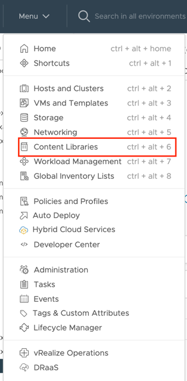
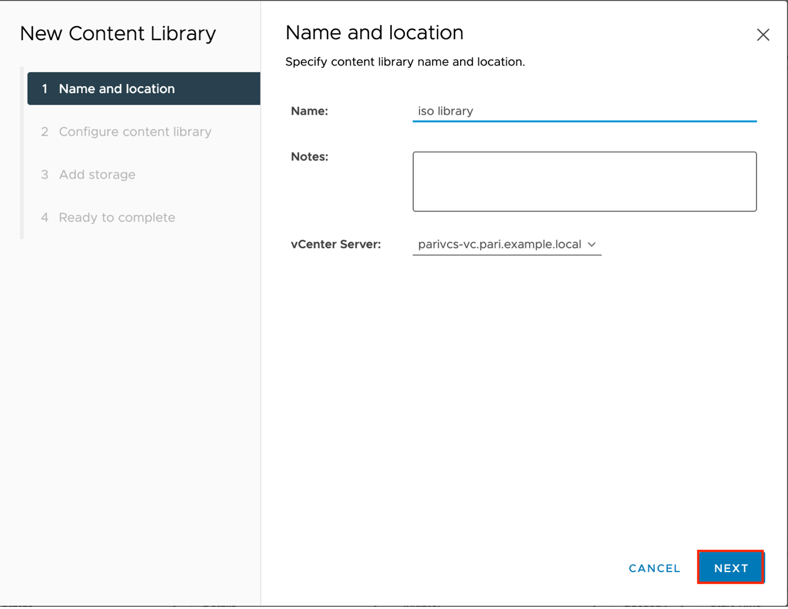
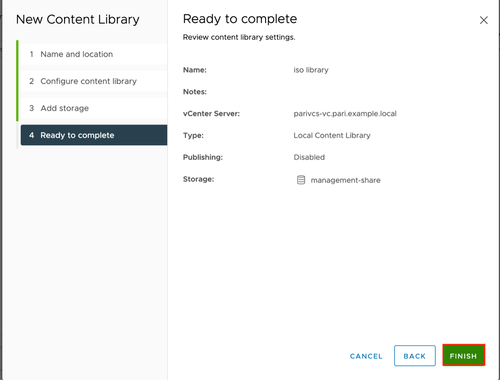
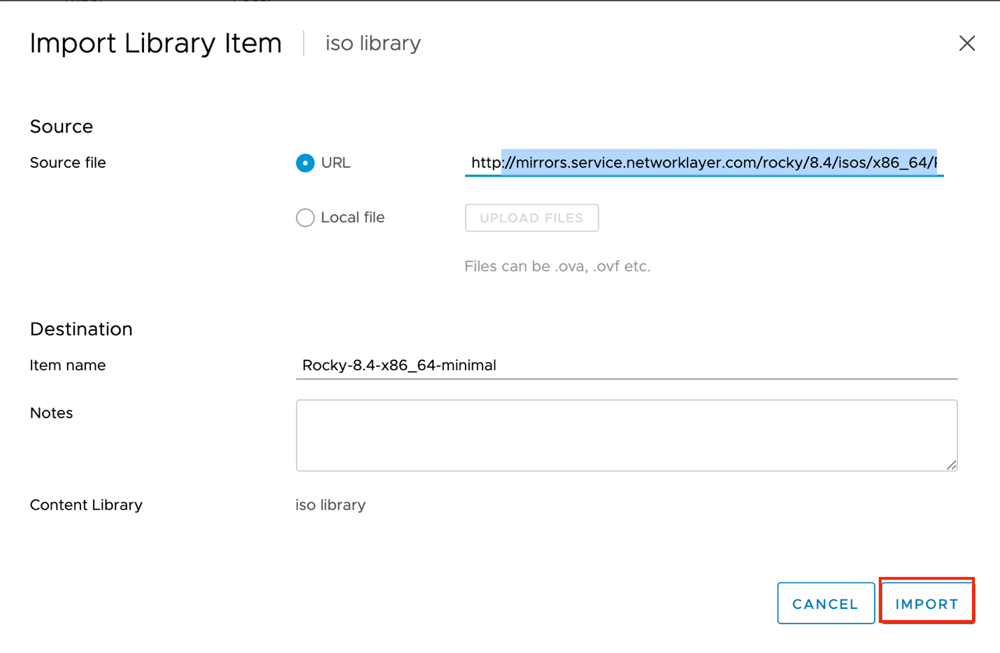
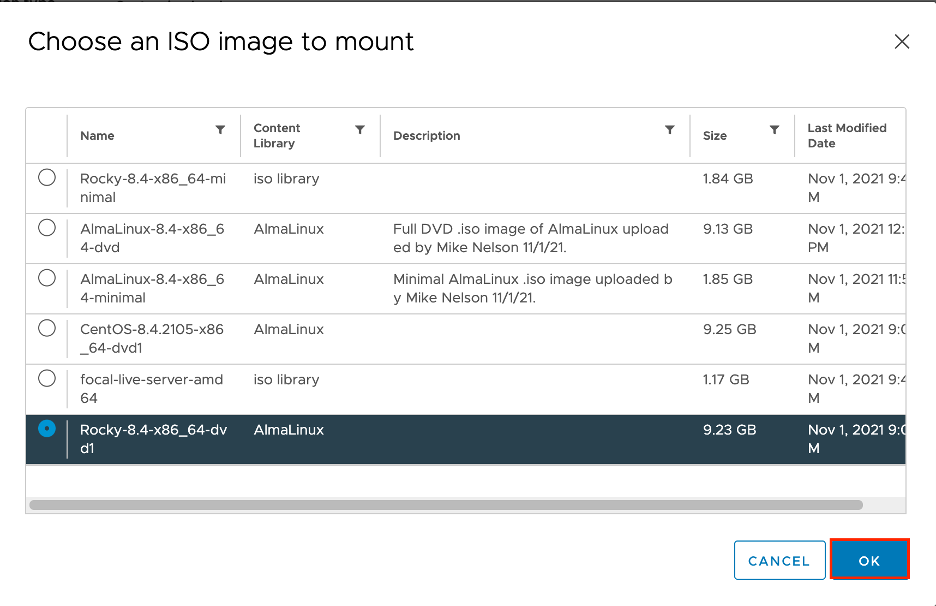
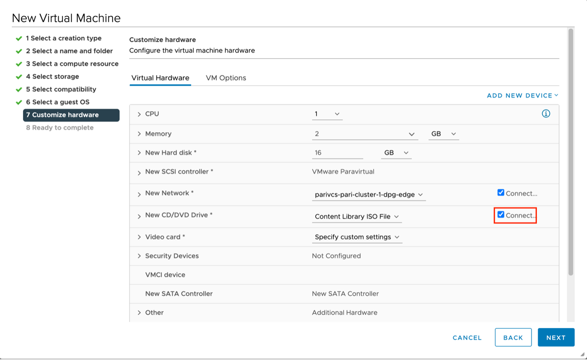

---

copyright:
  years: 2021, 2022
lastupdated: "2022-02-02"

subcollection: vmware-classic-journey

---

{{site.data.keyword.attribute-definition-list}}

# Deploy Initial VM workload
{: #vmware-onboarding-deploy-workload}

{: class="center"}

## Overview
{: #vmware-onboarding-deploy-workload-overview}

After provisioning your environment you may wish to test and validate your settings prior to bringing over your production virtual machines. Using content libraries and {{site.data.keyword.Bluemix_notm}}s internal mirrors this can be easily accomplished. 

The steps involved in the exercise are:

1. Creation of a content library
2. Import of operating system .isos from {{site.data.keyword.Bluemix_notm}} internal mirrors
3. Use of the content library in deploying a virtual machine. 

## Create Content Library
{: #vmware-onboarding-deploy-workload-create-library}

1. Log into vCenter using the IP address and credentials provided in the {{site.data.keyword.Bluemix_notm}} for VMware Solutions portal.

2. From the default start page using the menu select Content Libraries.

   

3. Select Create to create a new content library.

   

4. For configure content library leave the default (local content library) select and click Next.

   

5. Select a datastore to host your content library. IBM recommends that the management-share be used as shown in the example. Note that if your instance is comprised of multiple clusters all clusters must have the same share mounted for the library to be available. Click Next to continue.

   
   
6. Select finish to complete the wizard and create the content library.

   

7. Your content library should appear in the list of libraries. Once your content library has been created the next step is to upload images to the library. To import an operating system .iso image, click on the name of the library and then Actions > Import item.

   

   

8. The import library item wizard will appear. Enter the URL of the .iso image you wish to import. To make things easier without requiring full network connectivity to the Internet or an on-premise share, the {{site.data.keyword.Bluemix_notm}} internal mirrors can be leveraged. In the example below, the Rocky Linux 8.4 minimal ISO has been input. 
   
   **Note:** The following URLs will only work from within the {{site.data.keyword.Bluemix_notm}} Private Network.
   
   - Rocky Linux 8.4 minimal
     http://mirrors.service.networklayer.com/rocky/8.4/isos/x86_64/Rocky-8.4-x86_64-minimal.iso
   
   - Rocky Linux 8.4 DVD 
     http://mirrors.service.networklayer.com/rocky/8.4/isos/x86_64/Rocky-8.4-x86_64-dvd1.iso
   
   - CentOS 8.4 DVD
     http://mirrors.service.networklayer.com/centos/8/isos/x86_64/CentOS-8.4.2105-x86_64-dvd1.iso
   
   - Ubuntu Server 20.04.1 LTS (Focal Fossa)
     http://mirrors.service.networklayer.com/ubuntu-releases/ubuntu-server/focal/daily/current/focal-legacy-server-amd64.iso
   
   - Ubuntu Server 20.04.3 LTS (Focal Fossa)
     http://mirrors.service.networklayer.com/ubuntu-releases/ubuntu-server/focal/daily-live/current/focal-live-server-amd64.iso

     

     
   
9. Once completed your ISO image will show up as “Other Types” in the content library.

   

10. The last step is to use the content library image to deploy a virtual machine. To begin, provision a virtual machine as normal using the new virtual machine wizard. Upon reaching step 7 – customize hardware. Select the pull-down next to New CD/DVD drive and select content library ISO file.
    

11. A new window will appear. Select the image you wish to use and click OK. In the example Rocky-8.4-x86_64-dvd1 is selected.
    

12. Ensure the connected box is checked next to Content Library ISO file and then complete the wizard as usual. Once you start the virtual machine it will automatically boot the ISO image and begin the installation wizard of the selected operating system. 
    

## Next Steps
{: #vmware-onboarding-deploy-workload-next-steps}

At this point, you have successfully deployed your cluster!  Additional resources can be found within our [documentation](https://{DomainName}/docs/vmwaresolutions?topic=vmwaresolutions-understand-responsib).

